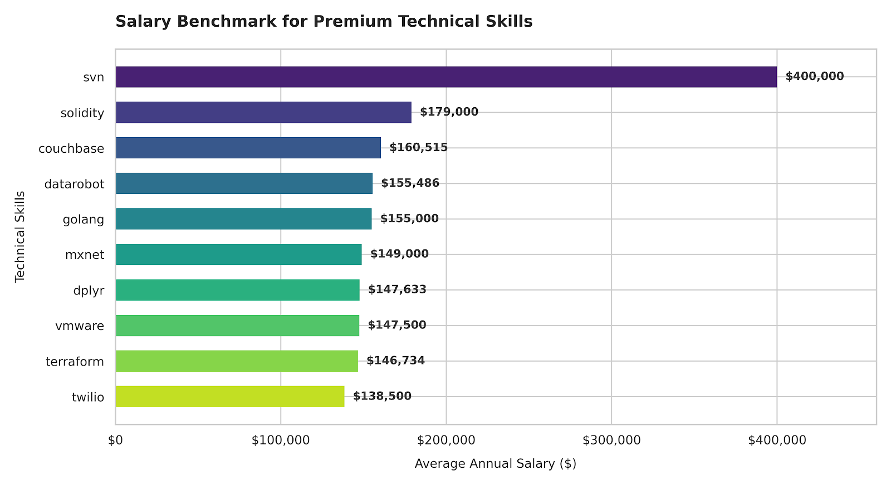
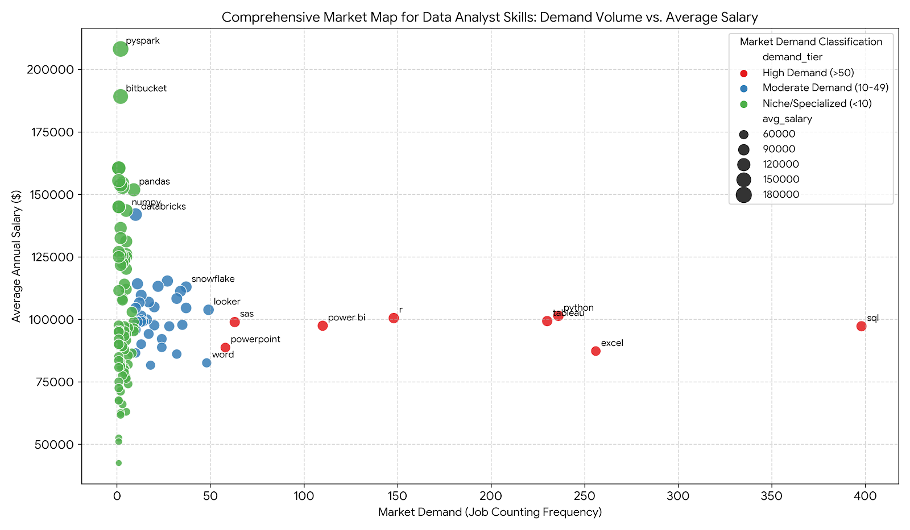

# SQL Data Analytics Project

## Project Overview

This project focuses on analyzing Data Analyst job postings using SQL and PostgreSQL to uncover valuable insights about salaries, skills, and remote job opportunities in the data analytics industry.

The analysis explores:

* Top-paying Data Analyst jobs
* Skills required for high-paying roles
* Most in-demand skills
* Highest-paying technical skills
* Optimal skills based on salary and demand

This project demonstrates practical SQL skills commonly used in real-world data analytics workflows.

---

# Tools & Technologies

* PostgreSQL
* SQL
* VS Code
* Git & GitHub

---

# SQL Concepts Used

The project uses several important SQL concepts including:

* SELECT Statements
* WHERE Filtering
* ORDER BY
* GROUP BY
* Aggregate Functions
* CASE Expressions
* JOINS
* CTEs (Common Table Expressions)
* Subqueries

---

# Project Structure

```text
SQL-Data-Analytics-Project/
│
├── images/
│   ├── 1_top_paying_jobs.png
│   ├── 2_top_paying_job_skills.png
│   ├── 3_most_demanded_skills.png
│   ├── 4_top_paying_skills_table.png
│   └── 5_optimal_skills_analysis.png
│
├── project_sql/
│   ├── 1_top_paying_jobs.sql
│   ├── 2_top_paying_job_skills.sql
│   ├── 3_most_demanded_skills.sql
│   ├── 4_top_paying_skills.sql
│   └── 5_optimal_skills.sql
│
└── README.md
```

---

# Analysis Questions

## 1. Top Paying Data Analyst Jobs

### Description

This analysis identifies the top 10 highest-paying remote Data Analyst jobs with available salary information. The query filters remote Data Analyst roles, joins company details, and sorts the results by salary in descending order to identify the best-paying opportunities in the market.

### SQL Query

```sql
SELECT
    job_id,
    job_title_short,
    company_dim.name AS Company_name,
    job_location,
    job_schedule_type,
    salary_year_avg,
    job_posted_date::DATE,
    CASE
        WHEN job_location='Anywhere' THEN 'Remote'
        ELSE job_location
    END AS job_locate
FROM
    job_postings_fact
LEFT JOIN company_dim
ON job_postings_fact.company_id=company_dim.company_id
WHERE
    job_title_short='Data Analyst' AND
    job_location='Anywhere' AND
    salary_year_avg IS NOT NULL
ORDER BY
    salary_year_avg DESC
LIMIT 10;
```

### Visualization

.png)

---

## 2. Skills Required for Top-Paying Data Analyst Jobs

### Description

This analysis identifies the technical skills required for the highest-paying remote Data Analyst jobs. The query combines the top-paying jobs with skill-related tables to determine which technologies and tools are commonly associated with high salaries.

Key skills identified include:

* SQL
* Python
* Tableau
* AWS
* Azure
* Power BI

### SQL Query

```sql
WITH top_paying_jobs AS (

    SELECT
        job_id,
        job_title_short,
        company_dim.name AS Company_name,
        job_location,
        job_schedule_type,
        salary_year_avg,
        job_posted_date::DATE,
        CASE
            WHEN job_location='Anywhere' THEN 'Remote'
            ELSE job_location
        END AS job_locate
    FROM
        job_postings_fact
    LEFT JOIN company_dim
    ON job_postings_fact.company_id=company_dim.company_id
    WHERE
        job_title_short='Data Analyst' AND
        job_location='Anywhere' AND
        salary_year_avg IS NOT NULL
    ORDER BY
        salary_year_avg DESC
    LIMIT 10

)
SELECT 
    top_paying_jobs.*,
    skills
FROM top_paying_jobs
INNER JOIN skills_job_dim
ON top_paying_jobs.job_id=skills_job_dim.job_id
INNER JOIN skills_dim
ON skills_job_dim.skill_id=skills_dim.skill_id
ORDER BY
    salary_year_avg DESC;
```

### Visualization


---

## 3. Most In-Demand Skills for Remote Data Analyst Jobs

### Description

This analysis identifies the most in-demand skills required for remote Data Analyst jobs by counting how frequently each skill appears in job postings.

The results show that SQL, Excel, Python, Tableau, and Power BI are among the most requested skills in the analytics job market.

### SQL Query

```sql
SELECT 
    skills,
    COUNT(skills_job_dim.job_id) AS demand_count
FROM job_postings_fact
INNER JOIN skills_job_dim ON job_postings_fact.job_id = skills_job_dim.job_id
INNER JOIN skills_dim ON skills_job_dim.skill_id = skills_dim.skill_id
WHERE
    job_title_short = 'Data Analyst' 
    AND job_work_from_home = True 
GROUP BY
    skills
ORDER BY
    demand_count DESC
LIMIT 5;
```

### Visualization


---

## 4. Top Paying Skills for Data Analysts

### Description

This analysis identifies the highest-paying skills associated with Data Analyst jobs by calculating the average salary for each skill.

The results highlight specialized technologies such as:

* Solidity
* Terraform
* Golang
* DataRobot
* Couchbase

showing that advanced technical skills are often linked to higher salaries.

### SQL Query

```sql
SELECT 
    skills_dim.skills,
    ROUND(AVG(job_postings_fact.salary_year_avg)) AS Avg_Salary
FROM job_postings_fact
INNER JOIN skills_job_dim
ON job_postings_fact.job_id=skills_job_dim.job_id
INNER JOIN skills_dim
ON skills_job_dim.skill_id=skills_dim.skill_id
WHERE 
    job_title_short='Data Analyst' AND
    salary_year_avg IS NOT NULL
GROUP BY
    skills_dim.skills
ORDER BY
    Avg_Salary DESC
LIMIT 10;
```

### Visualization



---

## 5. Optimal Skills for Remote Data Analyst Jobs

### Description

This analysis combines both demand count and average salary to identify the most optimal skills for remote Data Analyst jobs.

The findings show that skills like:

* SQL
* Python
* Tableau
* Snowflake
* AWS
* Azure

provide a strong balance between high demand and competitive salaries.

### SQL Query

```sql
SELECT 
    skills_dim.skill_id,
    skills_dim.skills,
    COUNT(skills_dim.skill_id) AS Counting,
    ROUND(AVG(job_postings_fact.salary_year_avg)) AS Avg_Salary
FROM job_postings_fact
INNER JOIN skills_job_dim
ON job_postings_fact.job_id=skills_job_dim.job_id
INNER JOIN skills_dim
ON skills_job_dim.skill_id=skills_dim.skill_id
WHERE 
    job_title_short='Data Analyst' AND
    salary_year_avg IS NOT NULL AND
    job_work_from_home=True
GROUP BY
    skills_dim.skill_id
ORDER BY
    Counting DESC,
    Avg_Salary DESC;
```

### Visualization



---

# Key Insights

* SQL is the most in-demand skill for Data Analysts.
* Remote Data Analyst roles offer highly competitive salaries.
* Python and Tableau are consistently required in high-paying jobs.
* Cloud and big data technologies are becoming increasingly valuable.
* Combining demand analysis with salary analysis helps identify the most valuable skills to learn.

---

# Learning Outcomes

Through this project, I improved my understanding of:

* SQL query writing
* Data analysis techniques
* PostgreSQL database management
* Business insight generation
* Data visualization integration
* Git and GitHub project management

---

# Future Improvements

Possible future enhancements include:

* Power BI dashboards
* Tableau visualizations
* Python-based data analysis
* Interactive analytics dashboards
* Automated reporting workflows

---

# Author

Chethan Reddy Gagenapally

* GitHub: [https://github.com/Chethanreddy1112](https://github.com/Chethanreddy1112)
* LinkedIn: [www.linkedin.com/in/chethan-reddy-gagenapally-199a51291](http://www.linkedin.com/in/chethan-reddy-gagenapally-199a51291)

---

# Conclusion

This project demonstrates how SQL can be used to analyze real-world job market data and generate meaningful business insights related to salaries, skills, and hiring trends for Data Analyst roles.
